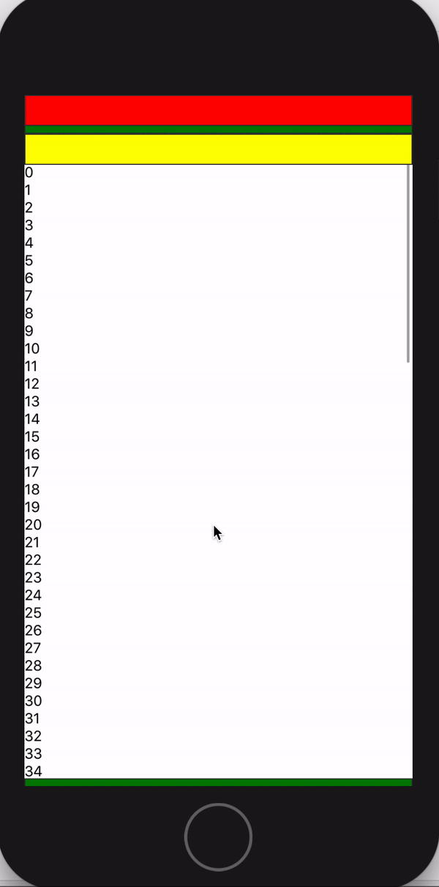

# React Native Web Headroom

Handling component that hide when scroll down, and showup when scroll up.



## Instalation
````bash
npm install react-native-web-headroom --save
````

## Run Example

````bash
cd examples/headroom
npm install
npm run ios
````

## Example
````javascript
import React from 'react';
import { ScrollView, View } from 'react-native';

import {Head, ScrollableComponent, HeadroomProvider} from 'react-native-web-headroom';

export default class App extends React.Component {
  render() {
    return (
      <View>
        <HeadroomProvider>
          <ScrollableComponent
            component={ScrollView}
            scrollEventThrottle={16}
          >
            {...}
          </ScrollableComponent>
          <HeadContainer>
            <Header backgroundColor="red" zIndex={10}/>
            <HeadComponent>
              <Header backgroundColor="green"/>
            </HeadComponent>
            <Header backgroundColor="yellow" />
          </HeadContainer>
        </HeadroomProvider>
      </View>
    );
  }
}
````

## API

### HeadroomContainer
todo

### HeadroomComponent
todo

### HeadroomProvider
todo

## Examples
See the [storybook](https://jekiwijaya.github.io/react-native-web-headroom/storybook).

## Contributing
PRs are welcome!